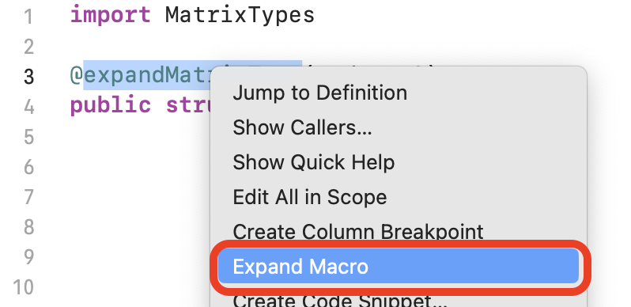
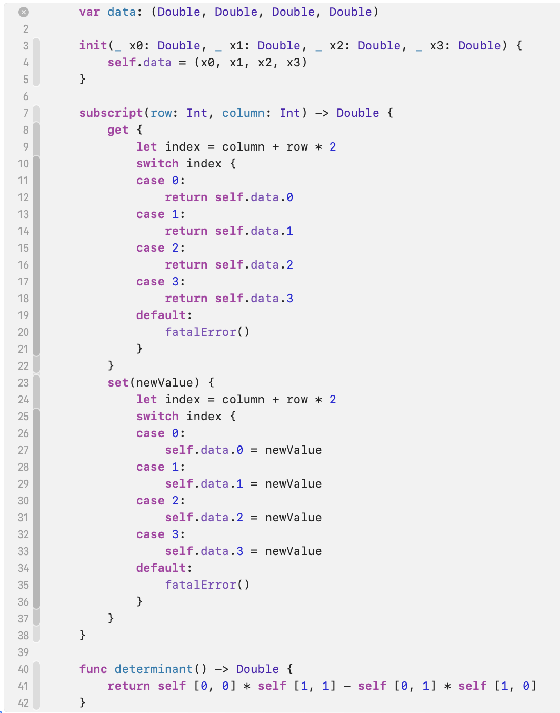

# Purpose

This library is somewhat of an experiment to see if it was possible to implement a macro in Swift to easily allow users to annotate structs as square matrix types, and generate supporting code to support mutation of them as well as computing their determinants. I had originally implemented matrix types of order 2, 3, and 4 by hand in my ray tracer, but someone close to me remarked that there was a fair amount of code duplication and that it should be possible to autogenerate that duplicated code via Swift macros. Hence, the creation of this library.


# Quick start

* Open Xcode
* Create a new project, using the Command Line Tool template
* Add this library, via File -> Add Packages...
  * Enter the URL of this repo, https://github.com/quephird/MatrixTypes, in the search field
  * Click the Add Package button in the main dialog box
  * Click the Add Package button in the new confirmation dialog box
  * Observe that MatrixTypes is now in the list under Package Dependencies in the Project Navigator
* Add the following to main.swift:

```swift
import MatrixTypes

@expandMatrixType(order: 2)
public struct Matrix2 {}
```

* Control click on the annotation, `@expandMatrixType`, and select "Expand macro":



* Observe that the following code was generated:



# Details

The macro generates the following members:

* a constructor that takes as many element parameters as are in the matrix (e.g., 9 parameters for a matrix of order 3)
* a `var` for local storage of the elements
* `get` and `set` subscript accessors
* a function for computing the determinant

For matrix types of order 3 and higher, supporting functions for computing minors and cofactors are also generated; they are not done for order 2 because they are not necessary for the computation of the determinant.

All of these implementations are dependent on the so-called order of the matrix, which is the length and height of the square matrix in question. (Determinants are not relevant for `m` by `n` matrices where `m != n`.)

It should also be noted that the implementation of the determinant is based on the Laplace expansion; there may be other methods with better performance but that is the one that I used in my ray tracer, and I just wanted to see if generating the code by a macro was possible.

# Relevant links

I relied on these resources for creating this:

* Scintilla ray tracer  
  [https://github.com/quephird/ScintillaLib](https://github.com/quephird/ScintillaLib)
* Laplace expansion  
  [https://en.wikipedia.org/wiki/Laplace_expansion](https://en.wikipedia.org/wiki/Laplace_expansion)
* WWDC talk, entitled "Expand on Swift Macros"  
  [https://developer.apple.com/videos/play/wwdc2023/10167/](https://developer.apple.com/videos/play/wwdc2023/10167/)
* Swift AST Explorer  
  [https://swift-ast-explorer.com/](https://swift-ast-explorer.com/)
